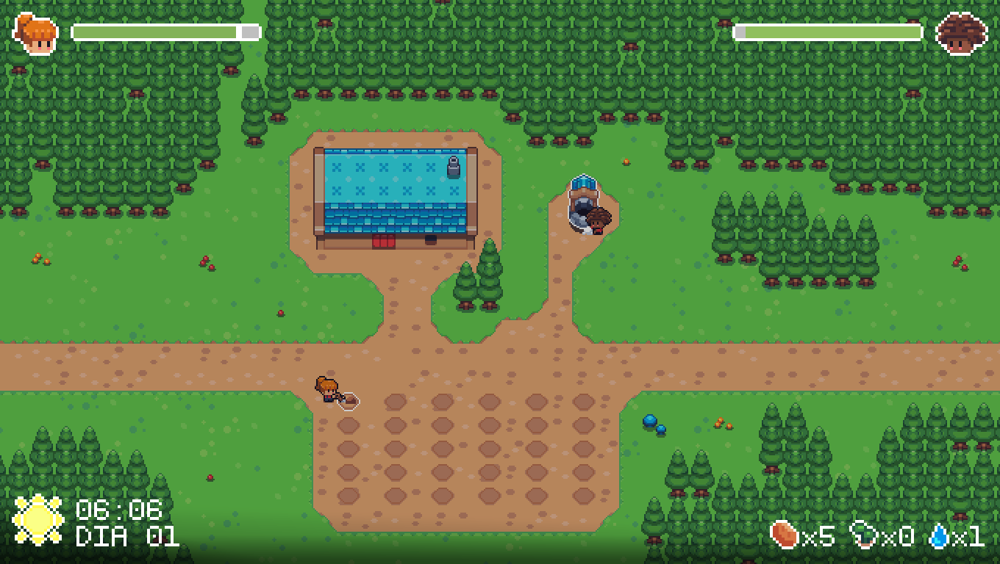

# Willa & Billy
Este projeto faz parte de um trabalho da disciplina de `Fundamento de Jogos Digitais`.
Em síntese, é um protótipo de um jogo de sobrevivência cooperativo para exatamente dois jogadores. Os dois vão ter que saber pensar rápido...

Como é um protótipo tem pouca coisa!

# Como jogar
Os jogadores começam com 5 batatas, cada batata pode ser plantada para gerar mais batatas, mas isso exigirá energia dos personagens. A vida, dentro do jogo, é representada pela energia, se a energia de algum dos personagens chegar a 0 ou os jogadores ficarem sem batatas é fim de jogo.

A todo modo momento Goblins podem atacar sem muito aviso prévio e tentar levar suas batatas, então descansar para recuperar energia nem sempre é uma opção. 

Quando ambos os jogadores estiverem dormindo o tempo é acelerado.

## Instalação
Os binários do jogo estão disponível [aqui](https://github.com/L-Marcel/willa-and-billy/releases/tag/1.0.0).

Lembrando que você tem que ter permissão para executar o binário. Para fechar o jogo, basta apertar `F8`.

## Willa
- `w, a, s, d` - andar;
- `j` - atacar;
- `k` - interagir;
- `shift` - correr.

### Características
- Protetora: perde menos energia ao tomar dano, mas causa bem menos dano;
- Impaciente: se move e ataca com mais rapidez, porém tem uma pequena chance de perder a colheita ao tentar colher;
- Diurna: realizar tarefas durante o dia levam menos tempo.

## Billy
- `setas` / `marcha da direita` - andar;
- `1` / `RT` - atacar;
- `2` / `Y` - interagir;
- `3` / `RB` - correr.

*Observações*: em algums teclados, tantas teclas simultaneamente podem falhar. Mas não se trata de uma falha do jogo, e sim de uma falha de hardware (o próprio teclado) ­- que as vezes não suporta tantas teclas precionadas simultaneamente (como é o caso do meu). Por isso o segundo jogador também pode controlar seu personagem por um `joystick`.

### Características
- Inquieto: a energia cai mais lentamente, porém também se recupera mais lentamente;
- Produtivo: demora menos tempo para plantar;
- Notívago: realizar tarefas durante a noite leva menos tempo.

